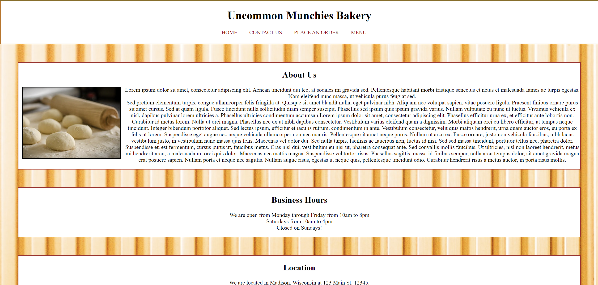

# Uncommon Munchies Bakery website (HTML and CSS only) 

# Spring 2020 - Final Project from Website Development class - Madison College

## The goal of this project was not to build a beautiful website but use all the knowledge we had learned from the class regarding the different HTML sectioning elements, coding conventions, HTML form validation as well as CSS properties, values and selectors. This site uses HTML and CSS code that was 100% validated from The W3C Validation Service. LINK TO LIVE PROJECT DOWN BELOW ↓↓

## Netlify Host Link https://uncommon-munchies-bakery.netlify.app/

